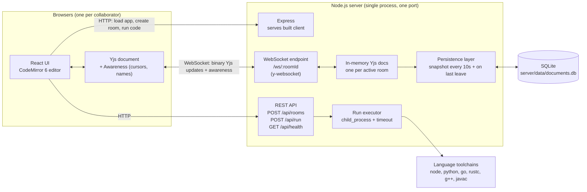

# Mini Multiplayer Editor

## What it does

This is a small real-time collaborative code editor. You open a link and land in a shared room. Anyone with that link can type in the same document at the same time. Everyone sees each other's edits and cursors live. The document is still there after a refresh or a server restart.

## Features

- **Edit together.** Many people can type at once, even on the same line. Everyone ends up with the same text. No edit gets lost or overwritten.
- **See who's here.** You join with a name and get a random color. Everyone's cursor and selection shows up live with a name tag. The avatar list updates when someone joins or leaves.
- **Shareable rooms.** Every room has its own link. Create one with a single click. Copy the link and send it to a friend.
- **Nothing gets lost.** The document is saved every few seconds. It is saved again when the last person leaves. A refresh or a restart brings your code back.
- **Pick a language together.** Choose JavaScript, TypeScript, Python, Go, Rust, C++ or Java. Highlighting changes for everyone in the room at once.
- **Run your code.** Press Run and the server executes your code. You see the real output and errors in a panel. JavaScript and TypeScript work out of the box. The other languages need their toolchain on the server. If it is missing, you get a clear "not found" message.
- **Connection status.** A small badge shows if you are connected. You always know if your edits are syncing.

Run is not a secure sandbox. Code runs as a plain process with a timeout. Only share room links with people you trust.

## Architecture



**How a keystroke travels.** Yjs turns your edit into a tiny binary update. It goes over the WebSocket to the server. The server relays it to everyone else in the room. Each client merges it into their own copy. CodeMirror redraws because it is bound directly to the Yjs document. Cursor positions use a separate awareness channel on the same socket. They are never stored.

**How saving works.** When the first person opens a room, the server loads its last snapshot from SQLite. While the room is active, it saves a snapshot every 10 seconds. It saves once more when the last person leaves.

## Tech stack

| Layer | Technology |
| --- | --- |
| Frontend | React 19, Vite, Tailwind CSS 4 |
| Editor | CodeMirror 6 |
| Real-time sync | Yjs (CRDT), y-codemirror.next, Yjs Awareness |
| Transport | WebSockets via y-websocket 2.0.4 |
| Backend | Node.js, Express 5, ws |
| Storage | SQLite via better-sqlite3 |
| Code execution | Node child_process, TypeScript compiler API |
| Hosting | Replit |

## Setup and deployment

You need Node 20 or newer.

### Run it on your machine

```bash
npm run install:all
npm run dev
```

The client runs on port 5173. The server runs on port 3001. Open http://localhost:5173 and click **New Room**. Open the room link in a second tab to see it sync live.

For the Run button, install the toolchain for each extra language you want. That means `python3`, `go`, `rustc`, `g++` or a JDK.

### Production build

```bash
npm run install:all
npm run build
npm start
```

This serves the client, the API and the WebSocket from one process on one port. The port is `PORT` if set, otherwise 3001.

### Deploy on Replit

The repo has a `.replit` file with a deployment section. Publishing works as it is.

- **Build** runs once per publish: `npm run install:all && npm run build && npm rebuild better-sqlite3 --build-from-source --prefix server`
- **Run** starts the app: `npm start`

Autoscale disks are not persistent. Saved documents reset when an instance restarts. To keep them, use a Reserved VM or swap `server/src/db.js` for a hosted database.
